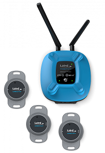

# MG100

The Sentrius MG100 Gateway is an out-of-the-box product allowing the end user to develop a fully featured IoT solution with minimum effort. With the addition of the optional battery backup, it provides uninterrupted reporting of sensor data. Additionally the sensor data is logged locally on an SD card to ensure data is captured even if the LTE connection is interrupted. Based on Laird Connectivity's Pinnacle 100 modem, the Sentrius MG100 Gateway captures data from Bluetooth 5 sensors and sends it to the cloud via a global low power cellular (LTE-M/NB-IoT) connection. It is based on the innovative integration of Nordic Semiconductor nRF52840 and the Sierra Wireless HL7800 module. This enables the MG100 hardware to support LTE-M/NB-IoT (supports LTE bands 1, 2, 3, 4, 5, 12, 13, 20, and 28) as well as Bluetooth 5 features like CODED PHY, 2M PHY, and LE Advertising Extensions.

>**WARNING:** This product contains a Li-ion battery. There is a risk of fire and burns if the battery pack is handled improperly. Do not attempt to open or service the battery pack. Do not disassemble, crush, puncture, short external contacts or circuits, dispose of in fire or water, or expose a battery pack to temperatures higher than 60 C (140 F). The Sentrius MG100 gateway was designed to use the supplied battery pack only. Contact Laird Connectivity Technical support if a replacement is required.

>**Note:** This readme file and associated documentation should be viewed on GitHub selecting the desired branch. The master branch will always be up to date with the latest features. Viewing documentation from a release GA branch is recommended to get documentation for the specific feature set of that release.

The MG100 firmware can operate in two modes:
* [LTE-M and AWS](#lte-m-and-aws)
* [NB-IoT and LwM2M](#nb-iot-and-lwm2m)

These two modes are selected at compile time. See the following sections for documentation on the demo and how it operates.

Download firmware releases from [here!](https://github.com/LairdCP/MG100_firmware/releases)

## LTE-M and AWS

The default [build task](.vscode/tasks.json) is setup to build the demo source code for LTE-M and AWS operation. [Read here](docs/readme_ltem_aws.md) for details on how the demo operates.

## NB-IoT and LwM2M

The MG100 can be compiled to work with NB-IoT and LwM2M communication to the cloud with the `build lwm2m` task in [tasks.json](.vscode/tasks.json).

For more details on the LwM2M demo, [read here](docs/readme_nbiot_lwm2m.md).

## Firmware Updates

If the MG100 is running v2.0.0 firmware or earlier, firmmare updates must be programmed via SWD(Serial Wire Debug). To do this please consult the MG100 Hardware Guide section 5.4.4 to learn how to connect a J-Link debugger to the board.

MG100 units with version 3.x or greater support firmware updates via UART, BLE or LTE.

[Read here](docs/firmware_update.md) for instructions on how to update firmware with an MG100 running v3.x or later.

## Development

### Cloning and Building the Source

This is a Zephyr-based repository, **DO NOT** `git clone` this repo. To clone and build the project properly, please see the instructions in the [MG100_firmware_manifest](https://github.com/LairdCP/MG100_firmware_manifest) repository.

### BLE Profiles

Details on the BLE profiles used to interface with the mobile app can be found [here](docs/ble.md)

### Development and Debug

See [here](docs/development.md) for details on developing and debugging this app.
