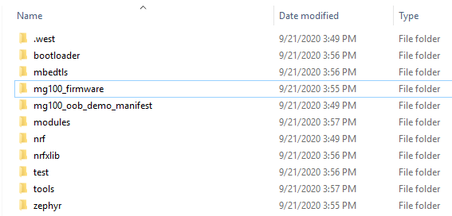
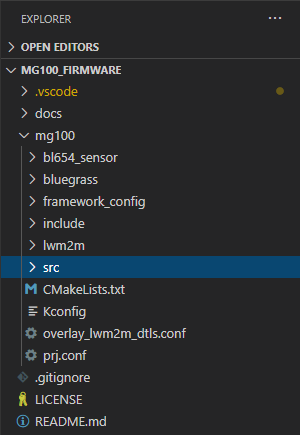
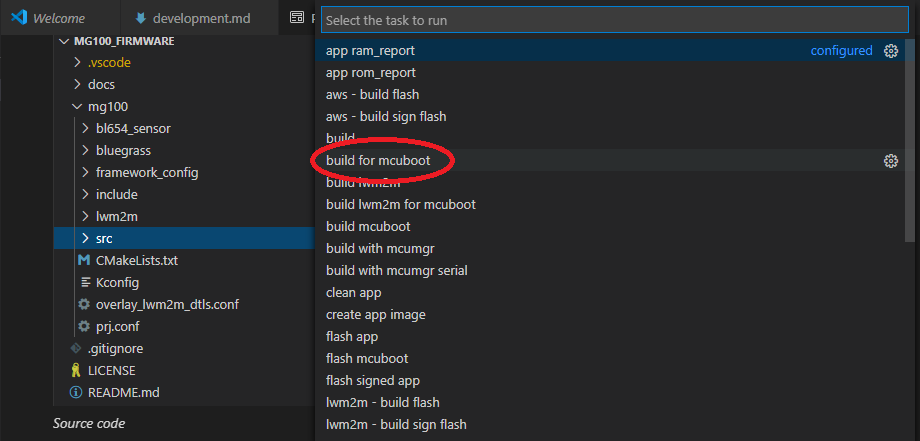
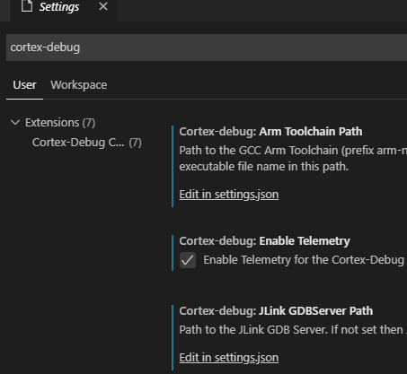

# Developing and Debugging the Firmware
The out of box demo source code can be used as a starting point for your own IoT cloud applications!
This document will explain how to use Visual Studio Code to build and debug the application.
>**Note:** These instructions assume you already have the Zephyr tools installed and can build the app successfully.  Please see [here](../README.md#preparing-to-build) if you have not completed those steps.

## Prerequisites
1. Install [J-Link Software and Documentation Pack](https://www.segger.com/downloads/jlink/#J-LinkSoftwareAndDocumentationPack) for J-Link drivers and software.
2. Install [Visual Studio Code](https://code.visualstudio.com/)
   
    Install the following VS Code extensions
    1. [C/C++ extension](https://marketplace.visualstudio.com/items?itemName=ms-vscode.cpptools)
    2. [Cortex-Debug extension](https://marketplace.visualstudio.com/items?itemName=marus25.cortex-debug)

## Building the Firmware

After cloning this repository with `west` you directory structure should look like:

  
*Demo folder*

Open the *mg100_firmware* folder with VS Code.  The source code is then viewable in the *mg100* folder.

  
*Source code*

There are VS Code tasks already setup to make building and flashing the firmware easy!
>**Note:** To view or edit the tasks.  Look at [.vscode/tasks.json](../.vscode/tasks.json).

To build the firmware, run the build task by selecting **Terminal -> Run Build Task...**

  
*Run build task*

Once the firmware has built, you can flash the firmware by running the **flash application** task.

Select **Terminal -> Run Task...**, then select **flash application**.

  
*Run flash task*

## Debugging the Firmware
Debugging the firmware on the MG100 requires a J-Link debugger and the Cortex-Debug extension for VS Code.

### Cortex-Debug Setup
Before debugging, some simple setup is required for Cortex-Debug.  Go to **File -> Preferences -> Settings**.

At the top of settings type `cortex-debug` to display the settings for that extension.  The *Arm Toolchain Path* and *JLink GDB Server Path* settings need to be set.  Click one of the *Edit in settings.json* links to edit the settings.

  
*Cortex-Debug settings*

Add the following lines to the settings.json file:
```
"cortex-debug.JLinkGDBServerPath": "C:\\Program Files (x86)\\SEGGER\\JLink\\JLinkGDBServerCL.exe",
"cortex-debug.armToolchainPath": "C:\\GNU_Tools_Arm_Embedded\\8_2019-q3-update\\bin",
```
>**Notes:** The paths may be different based on your installations of those tools.
>
>The paths shown above are Windows compatible paths.  If on Linux or macOS the paths should use single '/' characters.

### Firmware Setup
By default `CONFIG_FLASH_LOAD_OFFSET` is set to 0x1000 to work with the Laird secure bootloader that comes pre-installed on the MG100.  Setting `CONFIG_FLASH_LOAD_OFFSET` to 0 will allow you to flash and debug the firmware without the need for the bootloader.

In order to debug the firmware properly, it is recommended to change the optimization settings of the firmware when it is compiled.  This allows better breakpoint support and viewing temporary variable values. In [prj.conf](../oob_demo/prj.conf) look for:
```
CONFIG_NO_OPTIMIZATIONS
CONFIG_DEBUG_OPTIMIZATIONS
```
You can uncomment **one** of the lines and re-build the firmware.

`CONFIG_NO_OPTIMIZATIONS` is equivalent to -O0 in gcc.  See [here](https://gcc.gnu.org/onlinedocs/gcc/Optimize-Options.html)

`CONFIG_DEBUG_OPTIMIZATIONS` is equivalent to -Og.

### Starting the Debugger
Once the firmware is built, debugging can be started by going to **Debug -> Start Debugging**
>**Note:** Debugger settings for VS Code are setup in [.vscode/launch.json](../.vscode/launch.json).  That file is already setup to work with Cortex-Debug and this demo.

More info on debugging in VS Code can be found [here](https://code.visualstudio.com/docs/editor/debugging)

